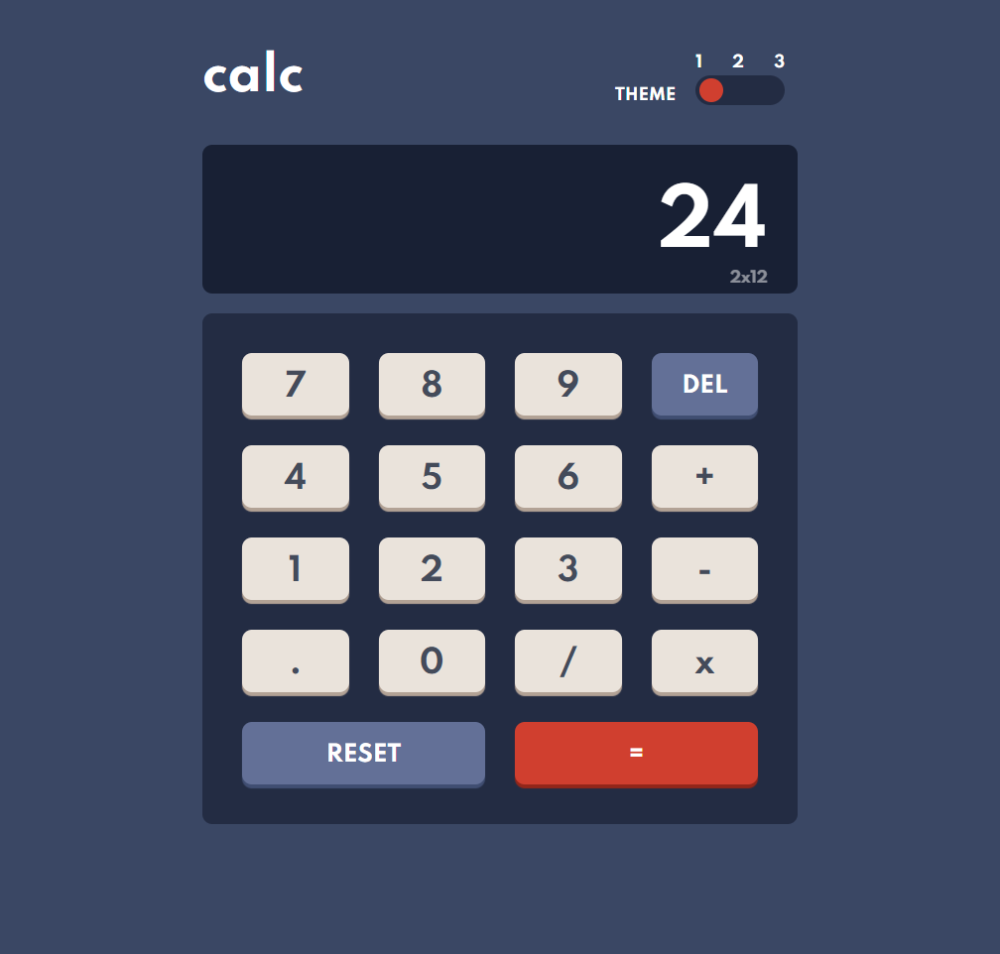

# Frontend Mentor - Calculator app solution
  

### The challenge

Users should be able to:

- See the size of the elements adjust based on their device's screen size
- Perform mathmatical operations like addition, subtraction, multiplication, and division
- Adjust the color theme based on their preference

### Screenshot

Computer view

Mobile view

### Built with

- HTML5
- CSS
- Lots of Javascript
- Flexbox
- CSS Grid

### What I learned

I had to think a lot with this one, like how to prevent user from : 
- typing more than one operator at a time ( e.g. `7++2`)
- using multiple dots on a single number ( e.g. `3.00.5`)
- typing a dot without a number before ( e.g. `.3`)

I also had an idea for the theme switcher : 
I'm putting all my DOM elements into an array, and interating through it with a `forEach()`, this way I'm using one line of code instead of one line for each DOM element I wish to change.

I made the toggle by myself this time, without getting any help or ressources on the internet, I'm pretty proud of it.

I used the `.replace(/x/g, "*");` function, which replaces all the `x` by `*`, which makes it more readable for the user.

### Way of improvement

It would be a nice addition to allow the user to type on his keyboard instead of clicking.